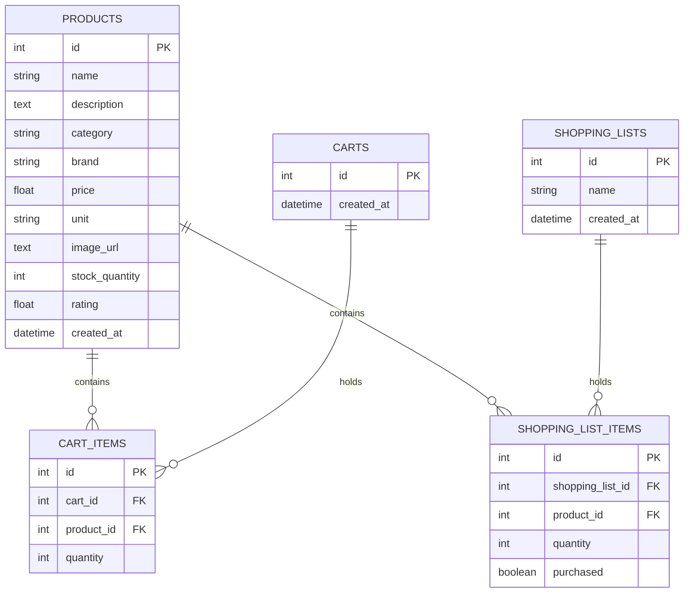

# SmartCart — Intelligent Grocery Shopping Assistant

[](https://fastapi.tiangolo.com)
[](https://www.python.org)
[](https://www.postgresql.org)
[](https://render.com)
[](LICENSE)

**SmartCart** is a modern, full-stack Grocery Shopping Assistant web application developed as a complete college capstone project. It bridges intuitive e-commerce grocery shopping with an **explainable multi-factor AI recommendation engine**, live cart subtotal calculations, and an interactive trip-planning shopping list.

The repository is built for **zero-friction cloud deployment** without requiring any local environment or container setup. It is ready to push directly to GitHub, deploy the backend to Render, and host the static frontend on any hosting platform.

---

## Table of Contents
1. [Project Overview](#project-overview)
2. [How This Project Works (Architecture & Data Flow)](#how-this-project-works)
3. [Key Features](#key-features)
4. [Technology Stack](#technology-stack)
5. [Folder Structure](#folder-structure)
6. [Database Schema](#database-schema)
7. [REST API Endpoints](#rest-api-endpoints)
8. [Recommendation System Algorithm](#recommendation-system-algorithm)
9. [Deployment Guide (GitHub → Render)](#deployment-guide)
10. [Database Initialization & Seeding](#database-initialization--seeding)
11. [Frontend Configuration](#frontend-configuration)
12. [Local Testing (Optional)](#local-testing-optional)
13. [Verification & Presentation Checklist](#verification--presentation-checklist)

---

## Project Overview

Online grocery shopping presents unique challenges compared to standard e-commerce:
- Users frequently buy items that naturally pair together (e.g., *Bread with Butter & Jam*, *Pasta with Sauce & Parmesan*, *Rice with Lentils & Spices*).
- Shoppers need to organize their recurring purchase plans using a checklist before adding items to their active cart.
- Immediate transparency: customers want to know *why* specific groceries are recommended to them.

SmartCart addresses these needs by combining a robust **FastAPI & PostgreSQL backend** with an ultra-fast, responsive **Vanilla HTML5/CSS3/JavaScript frontend** and an explainable scoring recommendation engine.

---

## How This Project Works

### End-to-End System Architecture

```text
               +---------------------------------------------+
               |              Shopper / Browser              |
               +---------------------------------------------+
                                      |
                     User Actions & Real-Time Events
                                      v
               +---------------------------------------------+
               |        Modern Frontend (Vanilla JS)         |
               |   [Home]   [Products]   [Cart]   [List]     |
               +---------------------------------------------+
                                      |
                        Async REST Calls (Fetch API)
                                      v
               +---------------------------------------------+
               |        FastAPI Backend (Python 3)           |
               |  - CORS & Middleware Validation             |
               |  - Pydantic Request/Response Schemas        |
               |  - Product, Cart, and List Routers          |
               +---------------------------------------------+
                     /                               \
                    /                                 \
                   v                                   v
   +-------------------------------+   +-------------------------------+
   |   Hosted PostgreSQL Database  |   |    Recommendation Engine      |
   | - Products (55+ items)        |   | - Complementary Graph Matrix  |
   | - Carts & Cart Items          |   | - Category Affinity Model     |
   | - Shopping Lists & Items      |   | - Popularity & Rating Weight  |
   +-------------------------------+   | - Explainable Reason Tags     |
                                       +-------------------------------+
                                                       |
                                            Scored Recommendations
                                                       v
                                       +-------------------------------+
                                       |      Client UI Rendering      |
                                       +-------------------------------+
```

### Why Python for the Recommendation Engine?
1. **Mathematical Scoring & Graph Traversal**: Python offers clean, expressive data structures and algorithmic scoring capabilities to evaluate multi-factor weights simultaneously.
2. **Domain Extensibility**: Python seamlessly integrates with advanced data science and machine learning libraries (e.g., Pandas, Scikit-learn, PyTorch) for future recommendation system upgrades.
3. **High-Performance Asynchronous Execution**: FastAPI utilizes Python's `asyncio` to handle concurrent user requests efficiently.

---

## Key Features

- **Product Catalog Management**:
  - 55+ realistic grocery products across 10 categories (*Fruits, Vegetables, Dairy, Bakery, Beverages, Snacks, Grains, Personal Care, Household, Frozen Food*).
  - Live search powered by backend query filtering with client-side **debouncing**.
  - Multi-criteria sorting (Price Low-High, Price High-Low, Rating, Name A-Z).
  - Category pill filter navigation.
- **Smart Shopping Cart**:
  - Live quantity modification (`+` / `-` controls) with automatic stock validation.
  - Dynamic line subtotals, 5% estimated tax, and total price calculation.
  - Interactive **Free Delivery Progress Tracker** with visual threshold feedback.
  - Contextual *"Frequently Paired with Your Cart Items"* suggestions.
- **Interactive Shopping List Planner**:
  - Trip progress bar with live completion percentage (*e.g., "4 of 6 items checked off — 67%"*).
  - One-click purchase status toggling with strike-through styling.
  - Direct *"Move to Cart"* action transferring list items into the active cart.
  - Quick-add dropdown selector to plan items effortlessly.
- **Multi-Factor Explainable Recommendations**:
  - Dynamic scoring based on complementary pairs, category affinity, customer ratings, and item popularity.
  - Transparent reasons: *"Frequently paired with 'Whole Wheat Bread' in your cart"*, *"Popular top pick in Dairy"*, etc.
- **Production UI/UX**:
  - Mobile-responsive layout (4-column desktop, 2-3 column tablet, 1-2 column mobile).
  - Animated Toast notifications, skeleton loading state placeholders, and empty states.
  - Zero third-party JavaScript framework lock-in (Pure Vanilla JavaScript).

---

## Technology Stack

| Layer | Technology | Purpose |
|---|---|---|
| **Frontend** | HTML5, CSS3, Vanilla JavaScript (ES6+) | Clean, responsive UI with zero compile step |
| **Icons & Typography** | FontAwesome 6 CDN, Google Fonts (Inter) | Modern aesthetics and intuitive iconography |
| **Backend Framework** | Python 3.11+, FastAPI, Uvicorn | High-performance asynchronous REST API |
| **Data Validation** | Pydantic v2 | Strict schema validation and serialization |
| **ORM & Database** | SQLAlchemy 2.0+, PostgreSQL (`psycopg2-binary`) | Relational mapping, connection pooling, and migrations |
| **Deployment** | Render (Web Service + Managed PostgreSQL + Static Site) | Cloud hosting with automated CI/CD and zero local config |

---

## Folder Structure

```text
grocery-shopping-assistant/
│
├── backend/
│   ├── app/
│   │   ├── __init__.py          # Package marker
│   │   ├── main.py              # FastAPI application entrypoint, CORS, lifespan & auto-seed
│   │   ├── database.py          # SQLAlchemy engine, session maker, Render URL parser
│   │   ├── models.py            # Database entity models (Product, Cart, ShoppingList, Items)
│   │   ├── schemas.py           # Pydantic validation schemas for requests & responses
│   │   ├── crud.py              # Database query logic & transaction helpers
│   │   ├── recommendations.py   # Explainable recommendation engine
│   │   └── routers/
│   │       ├── __init__.py      # Routers package marker
│   │       ├── products.py      # Product listing, search, category & CRUD routes
│   │       ├── cart.py          # Cart item manipulation & price aggregate routes
│   │       ├── shopping_list.py # Shopping list checklist & status routes
│   │       └── recommendations.py# Contextual recommendation routes
│   ├── requirements.txt         # Production backend dependencies
│   └── seed.py                  # Database seeder with 55+ realistic grocery products
│
├── frontend/
│   ├── index.html               # Home landing page with hero, search, & featured items
│   ├── products.html            # Catalog page with filters, sorting, & search
│   ├── cart.html                # Cart management page with dynamic totals
│   ├── shopping-list.html       # Shopping list planner with trip progress tracker
│   ├── css/
│   │   └── style.css            # Responsive CSS design system with custom properties
│   └── js/
│       ├── config.js            # Environment API Base URL configuration
│       ├── api.js               # Fetch API wrapper with error handling
│       ├── app.js               # Global UI controller, toasts, & badge sync
│       ├── products.js          # Products page controller
│       ├── cart.js              # Cart calculations & recommendations controller
│       ├── shopping-list.js     # Shopping list controller with progress metrics
│       └── recommendations.js   # Recommendation component cards renderer
│
├── .env.example                 # Environment variables template
├── .gitignore                   # Git ignore rules for Python, virtual environments, & OS files
├── render.yaml                  # Infrastructure-as-Code Blueprint for Render deployment
├── LICENSE                      # MIT Open Source License
└── README.md                    # Comprehensive documentation & presentation guide
```

---

## Database Schema



---

## REST API Endpoints

All API endpoints are documented interactively via OpenAPI at `/docs` and ReDoc at `/redoc`.

### 1. Products API (`/api/products`)
| Method | Endpoint | Description |
|---|---|---|
| `GET` | `/api/products` | Retrieve all products (supports `skip`, `limit`, `category`). |
| `GET` | `/api/products/{id}` | Retrieve single product details by ID. |
| `GET` | `/api/products/search?q={term}` | Search products matching name, brand, category, or description. |
| `GET` | `/api/products/category/{cat}` | Retrieve all products under a specific category. |
| `POST` | `/api/products` | Add a new product to the catalog. |
| `PUT` | `/api/products/{id}` | Update existing product details. |
| `DELETE`| `/api/products/{id}` | Delete a product from the catalog. |

### 2. Cart API (`/api/cart`)
| Method | Endpoint | Description |
|---|---|---|
| `GET` | `/api/cart?cart_id=1` | Retrieve active cart with item list, subtotals, tax, and total. |
| `POST` | `/api/cart/items` | Add product to cart (`{ product_id, quantity }`). |
| `PUT` | `/api/cart/items/{item_id}` | Update quantity of a cart item. |
| `DELETE`| `/api/cart/items/{item_id}` | Remove specific item from cart. |
| `DELETE`| `/api/cart` | Clear entire shopping cart. |

### 3. Shopping List API (`/api/shopping-list`)
| Method | Endpoint | Description |
|---|---|---|
| `GET` | `/api/shopping-list` | Retrieve shopping list with progress statistics. |
| `POST` | `/api/shopping-list/items` | Add product to shopping list (`{ product_id, quantity }`). |
| `PUT` | `/api/shopping-list/items/{item_id}` | Update quantity or status of an item. |
| `PATCH`| `/api/shopping-list/items/{item_id}/purchased` | Toggle purchased status (`{ purchased: true/false }`). |
| `DELETE`| `/api/shopping-list/items/{item_id}` | Remove item from shopping list. |
| `DELETE`| `/api/shopping-list` | Clear entire shopping list. |

### 4. Recommendation API (`/api/recommendations`)
| Method | Endpoint | Description |
|---|---|---|
| `GET` | `/api/recommendations` | Generate scored recommendations (accepts `cart_id`, `shopping_list_id`, `limit`). |

### 5. Health Check (`/health`)
| Method | Endpoint | Description |
|---|---|---|
| `GET` | `/health` | Service uptime and status check (`{ "status": "ok" }`). |

---

## Recommendation System Algorithm

The recommendation engine (`backend/app/recommendations.py`) evaluates multiple factors to provide explainable suggestions:

$$\text{Composite Score} = (w_1 \cdot S_{\text{comp}}) + (w_2 \cdot S_{\text{cat}}) + (w_3 \cdot S_{\text{rating}}) + (w_4 \cdot S_{\text{pop}})$$

1. **Complementary Pairing Matrix ($S_{\text{comp}}$)**:
   - Evaluates domain knowledge co-purchasing rules (e.g. *Pasta $\rightarrow$ Pasta Sauce, Parmesan Cheese, Olive Oil, Oregano*; *Bread $\rightarrow$ Butter, Jam, Eggs, Cheese*; *Rice $\rightarrow$ Dal, Spices, Oil*).
2. **Category Affinity ($S_{\text{cat}}$)**:
   - Determines cross-category synergy (e.g., Produce $\leftrightarrow$ Grains, Bakery $\leftrightarrow$ Dairy).
3. **Rating Score ($S_{\text{rating}}$)**:
   - Weights highly-rated products ($4.5+ \star$) positively.
4. **Popularity & Stock ($S_{\text{pop}}$)**:
   - Ensures in-stock, staple items are prioritized over unavailable products.
5. **Contextual Deduplication**:
   - Automatically excludes items already present in the active cart or shopping list.
6. **Explainable Reasons**:
   - Generates human-readable badges:
     - *"Frequently paired with 'Whole Wheat Bread' in your cart"*
     - *"Complements 'Yellow Moong Dal' in your shopping list"*
     - *"Top-rated favorite in Dairy"*

---

## Deployment Guide

Deploying SmartCart requires **zero local software**. Everything is deployed directly from GitHub to Render.

### Step 1: Push Code to GitHub

```bash
# Initialize git repository
git init

# Stage all project files
git add .

# Commit changes
git commit -m "Initial commit: Production-ready SmartCart application"

# Link your GitHub repository (replace with your GitHub URL)
git remote add origin https://github.com/YOUR_USERNAME/smartcart-grocery-assistant.git
git branch -M main
git push -u origin main
```

---

### Step 2: Deploy Backend on Render

1. Log into your [Render Dashboard](https://dashboard.render.com).
2. Click **New +** $\rightarrow$ **PostgreSQL**.
   - Name: `smartcart-db`
   - Plan: **Free**
   - Click **Create Database**.
   - Once created, copy the **Internal Database URL** (or **External Database URL**).
3. Click **New +** $\rightarrow$ **Web Service**.
   - Connect your GitHub repository.
   - **Root Directory**: `backend`
   - **Runtime**: `Python 3`
   - **Build Command**: `pip install -r requirements.txt`
   - **Start Command**: `uvicorn app.main:app --host 0.0.0.0 --port $PORT`
4. Under **Environment Variables**, add:
   - `DATABASE_URL` = *(Paste your Render PostgreSQL connection URL)*
   - `FRONTEND_URL` = `*` *(or your frontend URL after deploying the static site)*
5. Click **Create Web Service**.
6. Note down your backend URL (e.g., `https://smartcart-backend.onrender.com`).

---

### Step 3: Configure & Deploy Frontend

1. Open `frontend/js/config.js` in your GitHub repository and set:
   ```javascript
   const RENDER_BACKEND_URL = "https://smartcart-backend.onrender.com";
   ```
2. Commit and push the updated `config.js`.
3. In [Render Dashboard](https://dashboard.render.com):
   - Click **New +** $\rightarrow$ **Static Site**.
   - Connect your GitHub repository.
   - **Root Directory**: `frontend`
   - **Publish Directory**: `.`
   - Click **Create Static Site**.
4. *(Alternative Hosting)*: The `frontend/` folder can also be deployed instantly via **GitHub Pages**, **Vercel**, or **Netlify** with zero configuration.

---

## Database Initialization & Seeding

SmartCart is designed for **automatic zero-click database initialization**:

1. **Automatic Initialization**: On backend startup, the application creates all PostgreSQL tables (`Base.metadata.create_all`) and automatically seeds the 55+ realistic grocery catalog if the database is empty.
2. **Manual Seeding (Optional via Render Shell)**:
   If you ever want to re-seed or reset products, open the **Shell** tab in your Render Web Service dashboard and run:
   ```bash
   python seed.py --force
   ```

---

## Frontend Configuration

The API URL is managed in [`frontend/js/config.js`](file:///C:/Users/Asus/.gemini/antigravity/scratch/grocery-shopping-assistant/frontend/js/config.js):

```javascript
(function () {
  // SET YOUR RENDER BACKEND URL HERE:
  const RENDER_BACKEND_URL = "https://smartcart-backend.onrender.com";

  const isLocal =
    window.location.hostname === "localhost" ||
    window.location.hostname === "127.0.0.1" ||
    window.location.protocol === "file:";

  const defaultApiUrl = isLocal ? "http://127.0.0.1:8000" : RENDER_BACKEND_URL;

  window.APP_CONFIG = {
    API_BASE_URL: window.APP_CONFIG?.API_BASE_URL || defaultApiUrl,
    APP_NAME: "SmartCart",
    CURRENCY_SYMBOL: "$",
    FREE_SHIPPING_THRESHOLD: 35.0,
  };
})();
```

---

## Local Testing (Optional)

> [!NOTE]
> Local development is strictly optional. If you wish to test locally:

1. **Start Backend**:
   ```bash
   cd backend
   pip install -r requirements.txt
   uvicorn app.main:app --reload --port 8000
   ```
   *(If `DATABASE_URL` is omitted, the backend automatically uses an embedded SQLite database `smartcart.db` for instant local preview).*

2. **Open Frontend**:
   Simply double-click `frontend/index.html` or serve via Python:
   ```bash
   cd frontend
   python -m http.server 3000
   ```

---

## Verification & Presentation Checklist

Use this checklist during your project demonstration:

- [x] **Backend Health Check**: Visit `https://your-backend.onrender.com/health` $\rightarrow$ returns `{"status": "ok"}`.
- [x] **API Documentation**: Visit `https://your-backend.onrender.com/docs` $\rightarrow$ test Swagger endpoints interactively.
- [x] **Product Catalog**: Open `products.html` $\rightarrow$ verify 55+ products, search debounce, category filtering, and sorting.
- [x] **Shopping List Progress**: Open `shopping-list.html` $\rightarrow$ add items, check off items, verify dynamic percentage progress bar update.
- [x] **Cart Calculations**: Open `cart.html` $\rightarrow$ adjust quantities, observe real-time recalculations for subtotal, 5% tax, and free shipping tracker.
- [x] **Explainable AI Recommendations**: Add *Penne Rigate Pasta* or *Whole Wheat Bread* to cart $\rightarrow$ observe instant contextual suggestions (*Pasta Sauce, Cheese, Butter, Eggs*) with explainable badges.
- [x] **Responsive UI**: Test viewport scaling on desktop, tablet, and mobile screens.

---

## Future Improvements

1. **User Authentication & Profiles**: Multi-user JWT authentication allowing individual personal shopping histories.
2. **Collaborative Family Lists**: Real-time WebSocket synchronization for household shared shopping lists.
3. **Machine Learning Model Integration**: Incorporate Collaborative Filtering (Matrix Factorization / Neural Recommendations) trained on retail transaction datasets.
4. **Barcode Scanner Integration**: WebCam-based barcode scanner for instant pantry reordering.

---

## License

This project is licensed under the [MIT License](LICENSE).
# shopping-assistant

